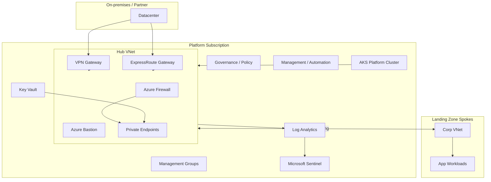

# Enterprise Landing Zone Architecture

Hub-and-spoke topology aligned with Microsoft Cloud Adoption Framework (CAF) landing zone design areas.

## Architecture diagram

## Layer model

| Layer | State key | Primary modules | Purpose |
|-------|-----------|-----------------|---------|
| Bootstrap | N/A (local first) | `state-backend` | Remote Terraform state |
| Foundation | `<env>/foundation` | management-group, subscription, resourceGroup | Hierarchy and subscriptions |
| Networking | `<env>/networking` | vnet, subnet, nsg, route-table, nat | Hub/spoke network fabric |
| Connectivity | `<env>/connectivity` | firewall, bastion, peering | Hub security and hybrid |
| Security | `<env>/security` | key-vault, managed-identity, defender, locks | Platform security services |
| Monitoring | `<env>/monitoring` | log-analytics, action-group, alerts | Observability foundation |
| Sentinel | `<env>/sentinel` | sentinel | SIEM onboarding |
| Governance | `<env>/governance` | policy, initiative, role-assignment, budget | Policy and cost controls |
| Management | `<env>/management` | automation-account | Runbooks and automation |
| Diagnostics | `<env>/diagnostics` | diagnostics-settings | Cross-resource logging |
| Backup | `<env>/backup` | recovery-services-vault, backup-policy-vm, ASR policy | VM backup and DR |
| Compute | `<env>/compute` | linux_vmss, windows-vmss, nic | Platform VMs |
| AKS | `<env>/aks` | aks-cluster, nodepool, extensions | Kubernetes platform |
| Landing zone | `<env>/landing-zone-corp` | vnet, peering | Workload spoke |

## Network addressing

| Environment | Hub CIDR | Spoke example |
|-------------|----------|---------------|
| Dev | 10.0.0.0/16 | 10.0.64.0/18 |
| QA | 10.1.0.0/16 | 10.1.64.0/18 |
| Prod | 10.2.0.0/16 | 10.2.64.0/18 |

## Security patterns

- Hub firewall as default egress for AKS (`VirtualAppliance` route)
- Private endpoints for PaaS with central private DNS
- Customer-managed keys via disk encryption sets
- Microsoft Sentinel on central Log Analytics workspace

## CI/CD

GitHub Actions workflow validates all dev layers and runs TFLint, TFSec, and Checkov on every PR to `main`, `dev`, or `uat`.
